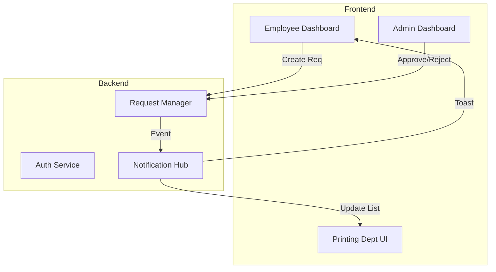

# 📚 Documentation Hub

Welcome to the technical documentation for the **School ERP Printing Management System**.
This hub serves as the central reference for developers, system administrators, and contributors.

> **[⬅️ Back to Project Dashboard](../README.md)**

---

## 🧭 Navigation Guide

The documentation is structured to separate concerns between the Client (Frontend) and Server (Backend).

### 🖥️ [Client Documentation](./client/README.md)
Focuses on the **React** application, user interfaces, and client-side logic.

| Resource | Description |
|----------|-------------|
| **[Architecture](./client/README.md)** | High-level overview of the implementation. |
| **[Components](./client/components/README.md)** | Guide to reusable UI elements (`Button`, `Card`, etc.). |
| **[Pages](./client/pages.md)** | Role-specific dashboard breakdown. |
| **[Routing](./client/routing.md)** | Authentication guards and navigation logic. |

### ⚙️ [Server Documentation](./server/README.md)
Focuses on the **Node.js/Express** API, business rules, and real-time systems.

| Resource | Description |
|----------|-------------|
| **[API Overview](./server/api-overview.md)** | Complete map of all REST endpoints. |
| **[Authentication](./server/auth.md)** | Deep dive into JWT handling and RBAC. |
| **[Print Logic](./server/print-request.md)** | The lifecycle of a print request (`Pending` → `Completed`). |
| **[Real-time](./server/notification.md)** | Architecture of the Socket.io notification system. |

---

## 🏗️ System Overview

The system operates on a **Client-Server** architecture facilitated by REST APIs and WebSockets.

## 🤝 Contribution Guidelines

1.  **Read the Docs**: Familiarize yourself with the [Client](./client/README.md) and [Server](./server/README.md) structures.
2.  **Code Standards**: Follow the ESLint configuration provided in the respective directories.
3.  **Updates**: If you modify code, please ensure this documentation is updated to reflect changes.

