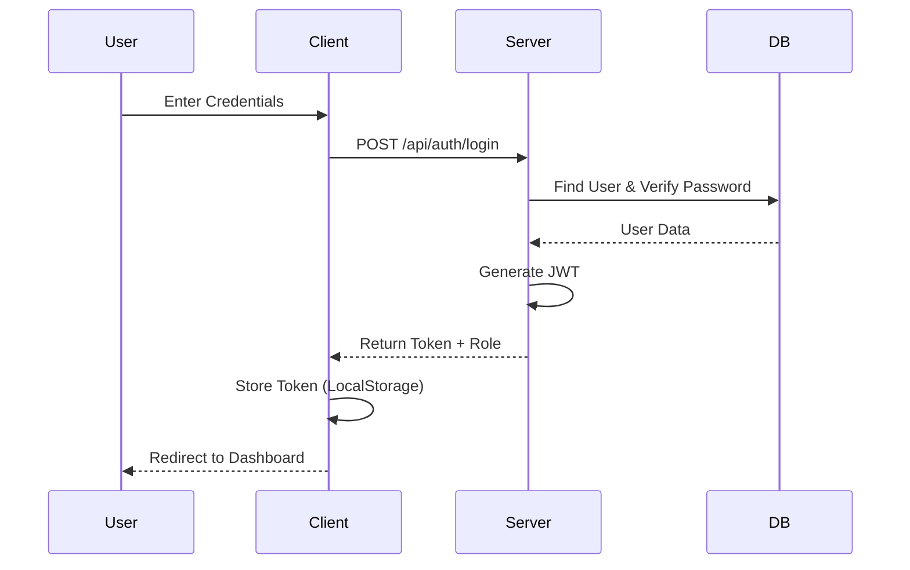

# Authentication System 🔐

The system uses **JSON Web Tokens (JWT)** for stateless authentication.

## User Model
The `User` schema supports three roles:
- `TEACHER`: Can sign up publicly.
- `ADMIN`: Seeded or manually added (cannot sign up).
- `PRINTING`: Seeded or manually added (cannot sign up).

## 🔐 Login Architecture

The system uses **JSON Web Tokens (JWT)** for stateless, secure session management.

### Sequence Flow

## Role-Based Access Control (RBAC)
Middleware `requireRole(['ROLE_A', 'ROLE_B'])` protects routes.
- Extracts token from `Authorization: Bearer <token>` header.
- Decodes token to get `user.role`.
- Grants or denies access based on the allowed roles array.
