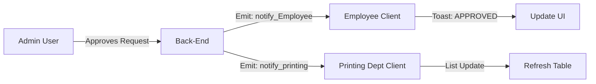

# Real-time Notification System 🔔

**PrintPortal** uses **Socket.io** to broadcast real-time events to connected clients.
This eliminates the need for manual refreshing by users.

## Architecture
- **Socket Initialization**: `config/socket.js` creates the IO instance.
- **Emission**: Controllers import `getIO()` to emit events during state changes (e.g., when an admin approves a request).
- **Listening**: Clients (`AuthContext`, `ToastContext`, or specific pages) listen for these events.

## 📶 Event Broadcast Flow

The backend acts as a real-time event hub, pushing updates to relevant clients instantly.



## Events

### `notify_Employee`
Broadcasts updates to a specific Employee's request.
*Ideally, this should be emitted to a specific socket room (e.g., `EmployeeId`), but currently broadcasts with a payload for the client to filter.*

**Payload:**
```json
{
  "type": "APPROVED" | "REJECTED" | "STATUS_UPDATE" | "FILE_DOWNLOADED",
  "requestId": "ObjectId",
  "message": "Human readable message"
}
```

### `notify_printing`
Broadcasts when a new job is available for the printing department.

**Payload:**
```json
{
  "type": "NEW_JOB",
  "requestId": "ObjectId",
  "message": "A new print request is ready for processing"
}
```

## Workflow Example
1. **Admin approves request** (`approvePrintRequest` controller).
2. Server emits `notify_Employee` -> Employee gets "Approved" toast.
3. Server emits `notify_printing` -> Printing dashboard refreshes list.
