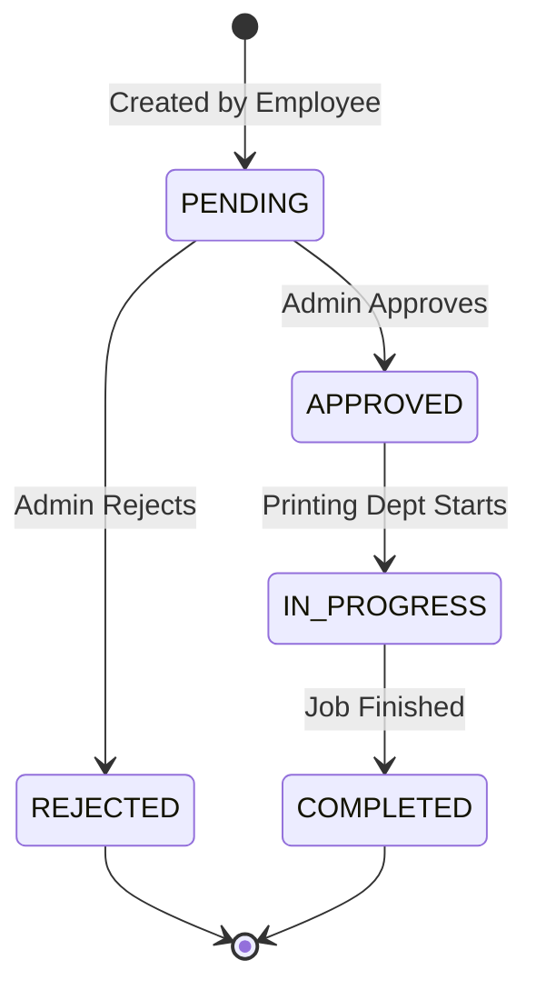

# Print Request Lifecycle 🔄

This document explains the core business logic for managing print jobs.

## Data Model (`PrintRequest`)
- **Employee**: ObjectId (User reference).
- **fileUrl**: Path to the uploaded file.
- **copies**: Number of copies.
- **printType**: `SINGLE_SIDE` or `DOUBLE_SIDE`.
- **status**: Enum (`PENDING`, `APPROVED`, `REJECTED`, `IN_PROGRESS`, `COMPLETED`).

## 🔄 Lifecycle State Machine

The print request lifecycle is strictly linear, ensuring clear accountability at each stage.

## Detailed States

1. **PENDING (Initial)**
   - **Trigger**: Employee submits form.
   - **Visibility**: Employee (My Requests), Admin (Approve Queue).
   
2. **APPROVED**
   - **Trigger**: Admin clicks "Approve".
   - **Event**: `notify_printing` emitted.
   - **Visibility**: Printing Dept Queue.

3. **REJECTED**
   - Action by **Admin**.
   - Process ends. Not visible to Printing Dept.
   - User notified.

4. **IN_PROGRESS**
   - Action by **Printing Dept** (when they start the job).
   - User notified "Printing Started".

5. **COMPLETED**
   - Action by **Printing Dept** (when finished).
   - User notified "Printing Completed".
